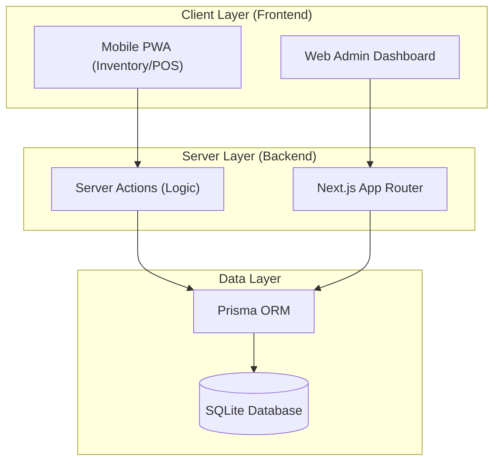

# System Architecture - SwiftStock

This document outlines the technical architecture of the Mobile Inventory & POS system, explaining how the frontend, backend, and database interact.

## 🏗️ High-Level Overview

SwiftStock uses a **Full-stack Monolith** architecture powered by **Next.js**. This approach ensures that the mobile interface, the admin dashboard, and the data processing logic live in a single, cohesive codebase.

---

## 💻 Frontend (Client Layer)
The frontend is built using **React** within the Next.js framework.

- **Responsive Design**: Uses **Vanilla CSS** with a mobile-first approach. The interface scales from handheld mobile devices (scanning) to wide-screen monitors (admin reporting).
- **Scanning Engine**: Uses the `html5-qrcode` library to access the device's camera via the browser (WebRTC) to decode EAN/UPC barcodes in real-time.
- **State Management**: Uses React Hooks (`useState`, `useEffect`) for managing the shopping cart and scanning states locally before committing to the server.

---

## ⚙️ Backend (Server Layer)
The backend is integrated directly into Next.js using **Server Actions**.

- **Server Actions**: Instead of traditional REST endpoints, we use `use server` functions. This allows for:
    - **Type Safety**: Seamless TypeScript types between frontend and backend.
    - **Security**: Logic and database credentials never reach the client side.
- **Business Logic**:
    - **Inventory Upsert**: Automatically detects if a product exists by barcode and either updates stock or creates a new entry.
    - **POS Logic**: Specifically handles stock deductions (atomic decrements) to prevent overselling.

---

## 🗄️ Database (Data Layer)
The storage layer focuses on simplicity and speed for local retail environments.

- **Prisma ORM**: Acts as the bridge between TypeScript code and the SQL database. It provides a type-safe client that handles all queries.
- **SQLite**: A file-based SQL database (`dev.db`). 
    - **Zero Admin**: No server to manage or install.
    - **ACID Compliant**: Ensures that a sale only completes if the stock is successfully deducted, preventing data corruption.
- **Connection Strategy**: Uses a **Singleton Pattern** in `src/lib/prisma.ts` to ensure only one database connection is open at a time, which is critical for the stability of Next.js in development mode.

---

## 🔄 Data Flow Example (Scanning a Sale)

1.  **Scanner**: Camera detects barcode `12345`.
2.  **Frontend**: Calls `getProductByBarcode('12345')` via a Server Action.
3.  **Backend**: Queries SQLite via Prisma. If found, returns product info.
4.  **User**: Adds to cart and clicks "Checkout".
5.  **Checkout**: Calls `processSale(cart)`.
6.  **Database Transaction**:
    - Creates a `Sale` record.
    - Creates `SaleItem` records for each product.
    - **Decrements** the `Product` quantity in the inventory.
7.  **Sync**: UI revalidates and shows the updated stock instantly.
